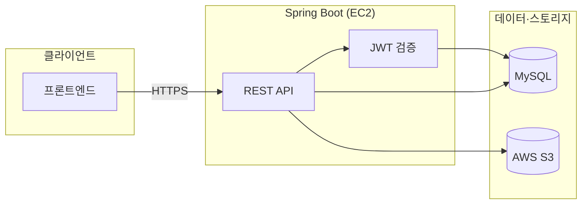
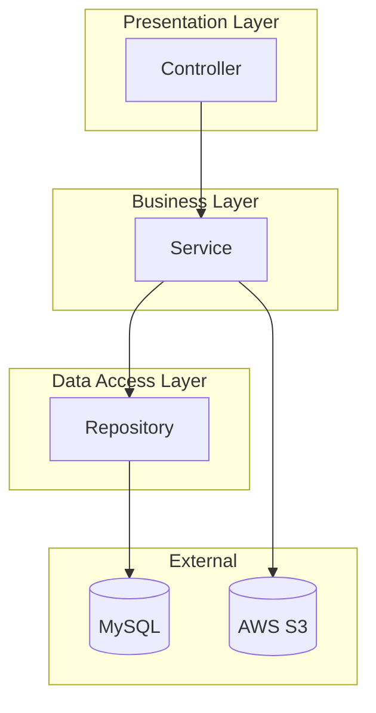
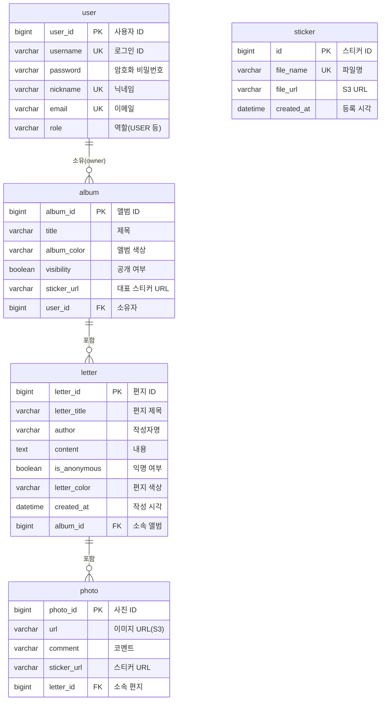
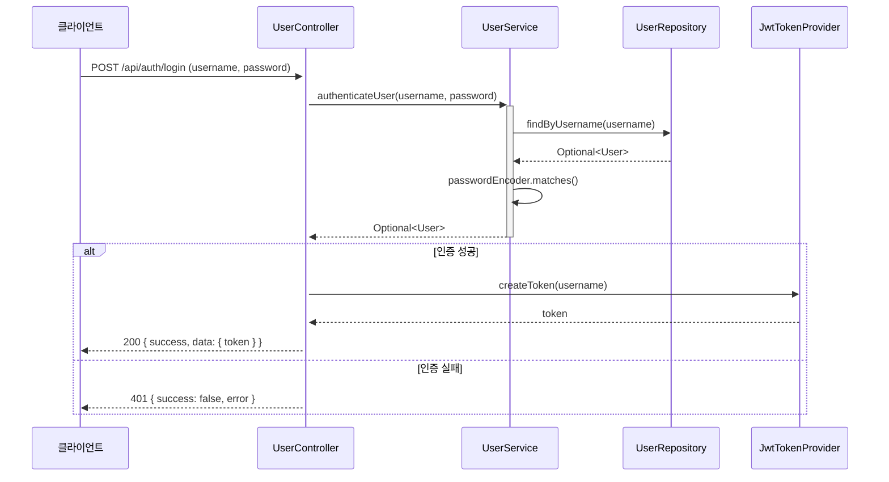
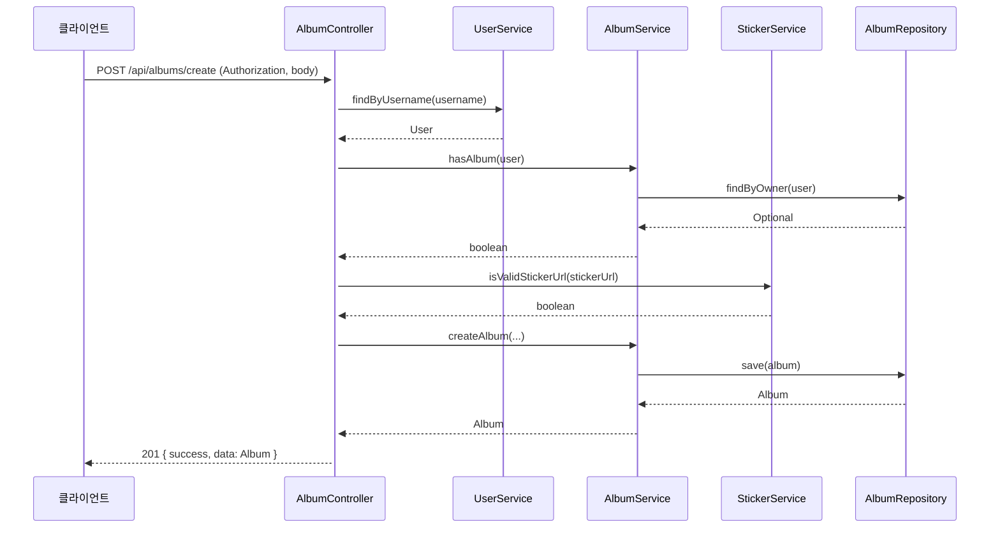
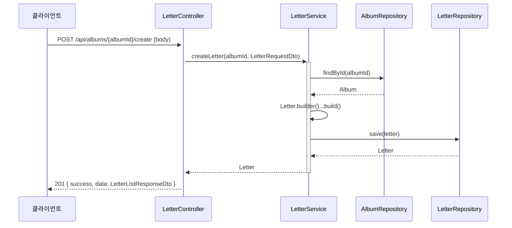
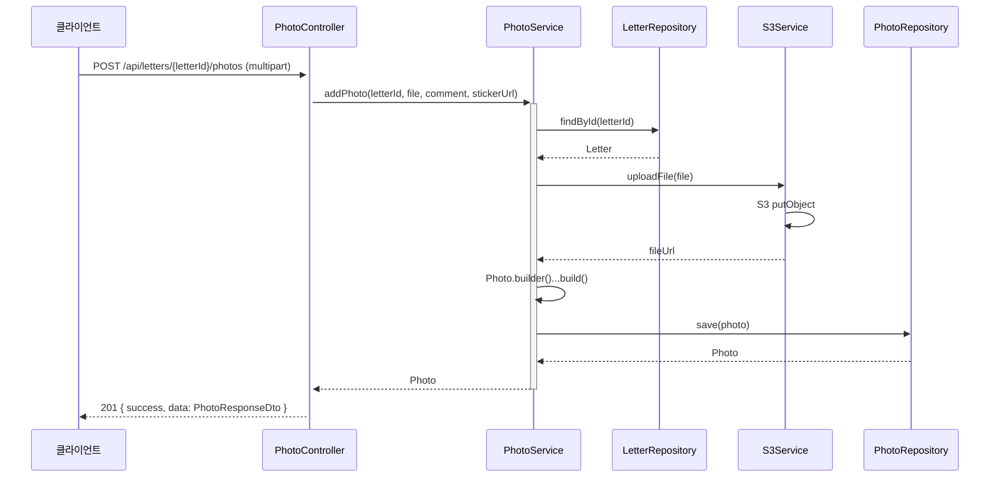

# Memory of Year (백엔드)

앨범, 사진, 편지, 스티커 등 사용자 생성 콘텐츠를 관리하는 백엔드 애플리케이션입니다.

**멋쟁이사자처럼 12기** 팀 **멋삼핑**에서 제작했습니다.  
디자인 1명, 프론트엔드 2명, 백엔드 4명이 참여했습니다.

---

## 🚀 주요 기능

- **JWT 토큰**을 활용한 사용자 인증·로그아웃(토큰 무효화) 및 권한 관리
- **앨범** 생성·조회·수정 (제목, 색상, 공개 여부, 스티커 URL)
- **편지** 작성·목록 조회·상세 조회 (익명/작성자명, 색상 지원)
- **사진** 업로드·목록·상세 조회 (S3 저장, 코멘트·스티커 URL)
- **스티커** 목록 조회 (S3 `stickers/` 폴더 기반)
- **홈** 앨범별 내 앨범/타인 앨범 구분 및 액션 정보
- **공통 API 응답** `{ success, data, error }` 형식 및 전역 예외 처리
- **Swagger**를 통한 API 문서화 및 테스트
- **AWS S3** 미디어 저장, **MySQL** 데이터베이스, **AWS EC2** 호스팅·**IAM** 접근 제어

---

## 🛠️ 사용 기술

| 기술 | 설명 |
|------|------|
| **Spring Boot 3** | REST API 및 비즈니스 로직 |
| **Spring Security + JWT** | 인증·인가, 토큰 검증·블랙리스트 |
| **Spring Data JPA** | 엔티티·리포지토리 |
| **MySQL** | 관계형 DB |
| **AWS S3** | 사진·스티커 파일 저장 |
| **Swagger (springdoc-openapi)** | API 문서·UI |
| **Lombok** | 보일러플레이트 감소 |
| **Gradle** | 빌드·의존성 관리 |

---

## 🏗️ 아키텍처

### 시스템 구성



- 클라이언트(프론트엔드)가 REST API로 요청 → JWT 검증 후 Controller → Service → MySQL/S3 사용.

### 레이어드 아키텍처 (백엔드)



| 레이어 | 역할 |
|--------|------|
| **Controller** | HTTP 요청/응답, DTO 변환, 인증 정보 활용 |
| **Service** | 비즈니스 로직, 트랜잭션, 예외 발생 |
| **Repository** | JPA로 엔티티 CRUD |
| **Filter** | JWT 검증·블랙리스트 확인 후 SecurityContext 설정 |

---

## 📐 ERD (Entity Relationship Diagram)



- **user** : 회원 정보. 한 명이 여러 **album**을 소유할 수 있음(실제 서비스에서는 1인 1앨범 정책 적용 가능).
- **album** : 앨범. 여러 **letter**를 가짐.
- **letter** : 편지. 여러 **photo**를 가짐.
- **photo** : 사진. S3 URL·코멘트·스티커 URL 저장.
- **sticker** : 스티커 마스터. 앨범·사진의 `sticker_url`은 문자열로 저장되며, 스티커 목록은 S3 폴더와 연동해 사용.

---

## 📊 시퀀스 다이어그램

### 로그인



### 앨범 생성



### 편지 작성



### 사진 업로드



---

## 📁 프로젝트 구조 (백엔드)

```
src/main/java/com/demo/album/
├── config/          # Security, S3, Swagger, Web, App 설정
├── controller/      # REST API (auth, albums, letters, photos, stickers, home)
├── dto/             # 요청·응답 DTO, ApiResponse
├── entity/          # User, Album, Letter, Photo, Sticker
├── exception/       # 커스텀 예외, GlobalExceptionHandler
├── filter/          # JwtTokenFilter
├── repository/      # JPA Repository
├── service/         # 비즈니스 로직 (User, Album, Letter, Photo, Sticker, S3)
└── util/            # JwtTokenProvider
```

---

## 🏃 실행 방법

- **Java 17**, **Gradle** 필요
- `application.yml`(또는 `application.properties`)에 MySQL, AWS S3 설정

```bash
./gradlew bootRun
```

- API 문서: `http://localhost:8080/swagger-ui.html` (실행 후)

---

## 📽️ 프로젝트 데모 (GIF)

<table>
  <tr>
    <td align="center">
      <br>
      <b>프로젝트 시작</b>
    </td>
    <td align="center">
      <br>
      <b>회원가입 & 로그인</b>
    </td>
  </tr>
  <tr>
    <td align="center">
      <br>
      <b>앨범 생성</b>
    </td>
    <td align="center">
      <br>
      <b>편지 생성</b>
    </td>
  </tr>
</table>
