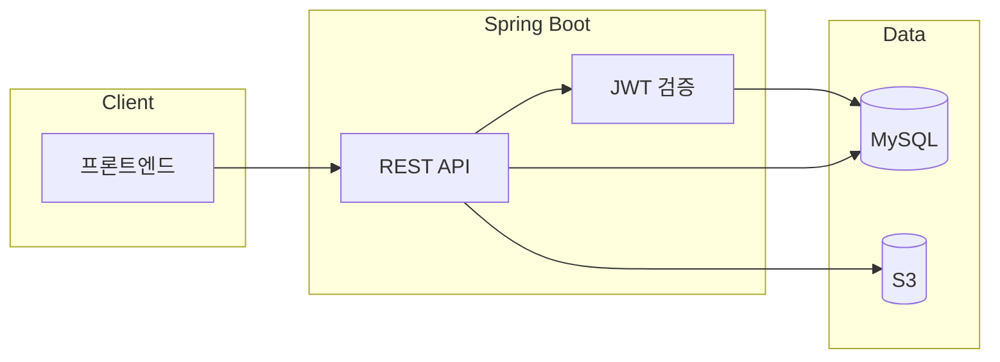
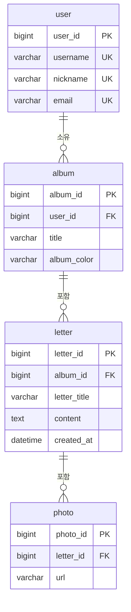
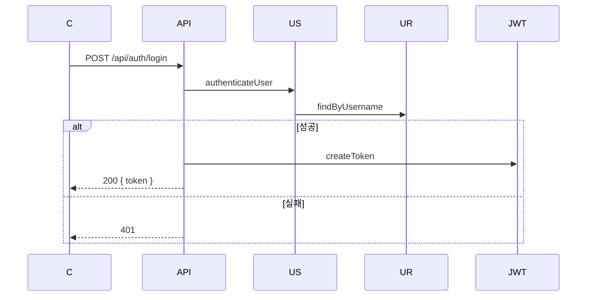
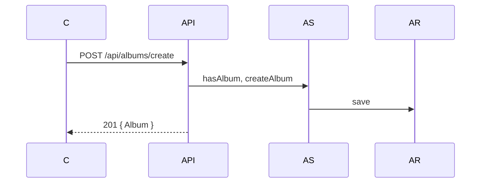
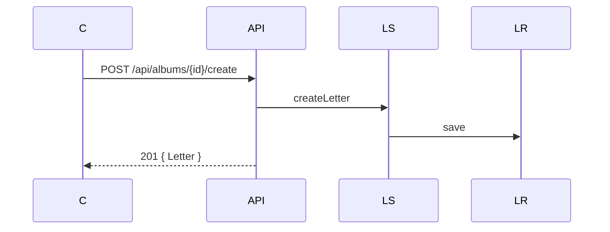
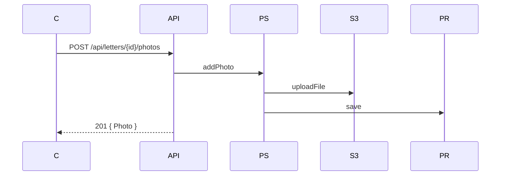

# Memory of Year (백엔드)

앨범·편지·사진·스티커를 관리하는 REST API 백엔드입니다.

**멋쟁이사자처럼 12기** 팀 **멋삼핑** | 디자인 1명, 프론트 2명, 백엔드 4명

---

## 실행 방법

### 로컬 (Gradle)

- **Java 17**, **Gradle** 필요

```bash
# H2 (기본)
./gradlew bootRun

# MySQL
./gradlew bootRun --args='--spring.profiles.active=mysql'
# 또는 MySQL 실행 후 MYSQL_HOST, MYSQL_USER, MYSQL_PASSWORD 환경변수 설정
```

### Docker

```bash
# MySQL 연동 (기본)
docker compose up --build

# H2 전용 (MySQL 없이)
docker compose -f docker-compose.h2.yml up --build
```

실행 후 API 문서: http://localhost:8080/swagger-ui.html

---

## 주요 기능

| 기능 | 설명 |
|------|------|
| 인증 | JWT 회원가입·로그인·로그아웃(토큰 무효화) |
| 앨범 | 생성·조회·수정 (제목, 색상, 공개 여부, 스티커) |
| 편지 | 작성·목록·상세 (익명/작성자명, photoCount 포함) |
| 사진 | S3 업로드·목록·상세 (코멘트, 스티커 URL) |
| 홈 | 내 앨범/타인 앨범 구분, 액션 정보 |

- 공통 응답 형식 `{ success, data, error }` · 전역 예외 처리
- Swagger API 문서 · AWS S3 미디어 저장 · MySQL

---

## 사용 기술

| 기술 | 용도 |
|------|------|
| Spring Boot 3 | REST API, 비즈니스 로직 |
| Spring Security + JWT | 인증·인가, 토큰 블랙리스트 |
| Spring Data JPA | 엔티티, 리포지토리 |
| MySQL / H2 | DB (로컬 기본 H2) |
| AWS S3 | 사진·스티커 저장 |
| Swagger, Lombok, Gradle | 문서화, 생산성, 빌드 |
| Docker, GitHub Actions | 컨테이너화, CI |
| JaCoCo | 테스트 커버리지 |

---

## 프로젝트 구조

```
src/main/java/com/demo/album/
├── config/       Security, S3, Swagger, Web
├── controller/   REST API (auth, albums, letters, photos, stickers, home)
├── dto/          ApiResponse, 요청·응답 DTO
├── entity/       User, Album, Letter, Photo, Sticker
├── exception/    GlobalExceptionHandler
├── filter/       JwtTokenFilter
├── repository/   JPA Repository
├── service/      비즈니스 로직
└── util/         JwtTokenProvider
```

---

## 성능 테스트

### 부하 테스트 결과 (k6, H2 로컬)

| API | VU | RPS | p95 | 실패율 |
|-----|-----|-----|-----|--------|
| 회원가입 | 10 | 16.5 | 115ms | 0% |
| 로그인 | 20 | 49.7 | 116ms | 0% |
| 앨범 조회 | 30 | 143.7 | 12.9ms | 0% |
| 편지 목록 (30개) | 20 | 96.7 | 13.8ms | 0% |

### N+1 해결: 편지 목록 API

편지 30개 + photoCount 조회 시:

| 구분 | Before | After |
|------|--------|-------|
| DB 쿼리 | 31회 (1+N) | 1회 |
| p95 | 22.8ms | **13.8ms** (↓40%) |
| 평균 | 11.5ms | **6.7ms** (↓42%) |

```java
// LetterRepository - 서브쿼리로 한 번에 조회
@Query("SELECT l, (SELECT COUNT(p) FROM Photo p WHERE p.letter = l) FROM Letter l WHERE l.album.albumId = :albumId ORDER BY l.createdAt")
List<Object[]> findLettersWithPhotoCountByAlbumId(@Param("albumId") Long albumId);
```

### 앨범 조회 N+1

- Before: 3회 (findById → owner → letters)  
- After: 1회 (`@EntityGraph`)

### 인덱스

`album.user_id` · `letter.album_id` · `letter.created_at` · `photo.letter_id`

### 테스트 실행

```bash
k6 run load-test/01-register.js
k6 run load-test/02-login.js
k6 run load-test/03-album-get.js
k6 run load-test/04-letters.js
```

Before/After 비교: `APP_PERF_USE_N1_LETTERS=true ./gradlew bootRun` 후 04-letters 실행 → [load-test/README.md](load-test/README.md)

### Actuator

`/actuator/health` · `/actuator/metrics` · `/actuator/info`

### CI / 테스트 커버리지

- **GitHub Actions**: push 시 `./gradlew test` 자동 실행
- **JaCoCo**: `./gradlew test jacocoTestReport` → `build/reports/jacoco/test/html/index.html`

---

## 아키텍처

### 시스템 구성



### 레이어

| 레이어 | 역할 |
|--------|------|
| Controller | HTTP, DTO 변환 |
| Service | 비즈니스 로직, 트랜잭션 |
| Repository | JPA CRUD |
| JwtTokenFilter | 토큰 검증, SecurityContext |

---

## ERD



---

## 시퀀스 다이어그램

<details>
<summary>로그인</summary>


</details>

<details>
<summary>앨범 생성</summary>


</details>

<details>
<summary>편지 작성</summary>


</details>

<details>
<summary>사진 업로드</summary>


</details>

---

## 프로젝트 데모

<table>
  <tr>
    <td align="center">
      <br>
      <b>프로젝트 시작</b>
    </td>
    <td align="center">
      <br>
      <b>회원가입 & 로그인</b>
    </td>
  </tr>
  <tr>
    <td align="center">
      <br>
      <b>앨범 생성</b>
    </td>
    <td align="center">
      <br>
      <b>편지 생성</b>
    </td>
  </tr>
</table>
